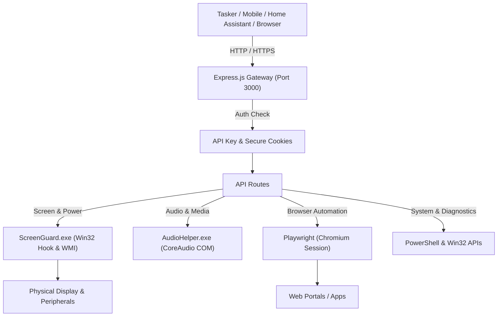

# Express Gateway Automation

[](https://opensource.org/licenses/MIT)
[](https://nodejs.org/)
[](https://www.microsoft.com/windows/)
[](https://playwright.dev/)
[](https://expressjs.com/)

A lightweight, robust local **API Gateway & Workspace Automation Server** built on Node.js/Express for Windows. Seamlessly connects mobile triggers (Tasker, HTTP Shortcuts, Home Assistant, Stream Deck) with Windows native APIs, audio/multimedia subsystems, persistent browser automation, and intelligent display power management.

---

## Key Features

### 🛡️ Smart ScreenGuard (Physical Display & Remote Desktop Management)
- **Low-Level Native Hook:** Built with a custom C# Win32 helper (`ScreenGuard.exe`) hooking `WH_KEYBOARD_LL` and `WH_MOUSE_LL` to differentiate real physical hardware interaction from injected software events (`LLKHF_INJECTED` / `LLMHF_INJECTED`).
- **Remote Desktop Inactivity Watchdog:** Allows remote interaction (Google Remote Desktop, ScreenConnect, Moonlight) without waking the physical screen, enforcing `SC_MONITORPOWER` standby after 12 seconds of remote inactivity.
- **WMI 0% Brightness Drop:** Drops monitor backlight to 0% via WMI (`WmiMonitorBrightnessMethods`) when entering standby, restoring baseline brightness upon physical wake up.
- **Toast Notification Shield:** Intercepts `GUID_CONSOLE_DISPLAY_STATE` events to re-standby monitors if Windows toast notifications or background processes inadvertently light up the screen.

### 🌐 Persistent Browser Automation & Keepalive
- **Playwright Chromium Engine:** Headless or headed browser instance with persistent session profiles (`browser_user_data`).
- **Enterprise SSO Support:** Automated corporate credential handler and re-authentication banner monitor for enterprise web portals.
- **Customizable Activity Keepalive:** Scheduled window interaction, keystrokes, and mouse movements to maintain persistent online sessions during configurable working hours.
- **Scheduled Power & Auto-Close:** Define custom start/end active schedules, meal/break pauses, and auto-shutdown crons.

### 🔊 Audio, Multimedia & Hardware Controls
- **CoreAudio / COM Native Integration:** High-performance C# helper (`AudioHelper.exe`) for reading and adjusting master volume, mute state, and real-time audio playback status without shell execution lag.
- **Media Keys:** Play/Pause, Next Track, Previous Track injection.
- **Hardware Brightness:** Fine-grained physical display brightness control via WMI.
- **Text-to-Speech (TTS):** Local voice synthesizer endpoint using the Windows Speech API.

### 📋 Remote Clipboard & Diagnostics
- **Clipboard Sync:** Read and write Windows clipboard remotely with UTF-8 encoding support.
- **Multi-Monitor DPI-Aware Screenshot:** Capture all connected displays with full DPI scaling and taskbar visibility.
- **Self-Healing Remote Restart:** Safe, non-blocking asynchronous server restart via decoupled VBS launcher (`remote_restart.vbs`).

### 📱 Responsive Glassmorphism Dashboard
- Dark glassmorphism web UI optimized for mobile touch and desktop.
- Drag-and-drop customizable layout order and section toggles.
- Authenticated via secure HTTP-only cookies or `X-API-KEY` headers.
- Built-in ngrok tunnel integration for secure remote WAN access with static domains.

---

## Architecture Overview



---

## Quick Start

### Prerequisites
- Windows 10 / Windows 11 / Windows Server
- [Node.js](https://nodejs.org/) (version 18 or higher recommended)
- .NET Framework 4.0+ (pre-installed on Windows 10/11)

### Installation

1. **Clone the repository:**
   ```bash
   git clone https://github.com/ismael6499/express-gateway-automation.git
   cd express-gateway-automation
   ```

2. **Install dependencies:**
   ```bash
   npm install
   ```

3. **Configure Environment:**
   Copy the template `.env.example` to `.env`:
   ```bash
   copy .env.example .env
   ```
   Edit `.env` with your desired configuration:
   ```env
   PORT=3000
   API_KEY=your-secure-api-key-here
   TARGET_WEB_URL=https://example.com
   TARGET_ACCOUNT_EMAIL=user@example.com
   NGROK_AUTHTOKEN=your-ngrok-token
   NGROK_DOMAIN=your-static-domain.ngrok-free.dev
   ```

4. **Start the Server:**
   ```bash
   npm start
   ```
   Or run the included batch script:
   ```cmd
   start_server.bat
   ```

The dashboard will be accessible locally at `http://localhost:3000`.

---

## API Reference

All requests must provide authentication using the `X-API-KEY` header or a valid session cookie.

### Browser Session & Automation (`/browser`)

| Method | Endpoint | Description | Sample Payload |
|---|---|---|---|
| `POST` | `/browser/browser` | Controls browser lifecycle (`abrir`, `cerrar`, `minimizar`, `restaurar`) | `{"accion": "abrir"}` |
| `POST` | `/browser/presencia` | Toggles activity simulation or changes interval | `{"accion": "toggle"}` |
| `POST` | `/browser/programacion` | Configures schedule and auto-close hours | `{"startHour": "09:00", "endHour": "18:00"}` |
| `POST` | `/browser/simular-accion` | Injects immediate test actions (typing, mouse, shift) | `{"accion": "tipear-buscador"}` |
| `GET` | `/browser/ultima-actividad` | Returns timestamp and seconds since last keepalive | - |

### System, Screen & Hardware (`/sistema`)

| Method | Endpoint | Description | Sample Payload |
|---|---|---|---|
| `POST` | `/sistema/teclado` | Manages display standby & ScreenGuard guard | `{"accion": "apagar-guardia"}` |
| `POST` | `/sistema/screenguard-toggle` | Toggles intelligent ScreenGuard watchdog on/off | - |
| `GET` | `/sistema/portapapeles` | Reads current Windows clipboard text | - |
| `POST` | `/sistema/portapapeles` | Writes UTF-8 text into clipboard | `{"text": "Hello world"}` |
| `GET` | `/sistema/screenshot` | Captures multi-monitor screenshot | Returns PNG binary |
| `POST` | `/sistema/media` | Media playback controls (`playpause`, `next`, `prev`) | `{"accion": "playpause"}` |
| `POST` | `/sistema/volumen` | Sets master volume (0-100) | `{"volumen": 35}` |
| `POST` | `/sistema/brillo` | Sets physical monitor brightness (0-100%) | `{"brillo": 80}` |
| `POST` | `/sistema/tts` | Text-to-speech speaker synthesis | `{"texto": "Server active"}` |
| `POST` | `/sistema/energia` | PC energy controls (`suspender`, `apagar`, `reiniciar`) | `{"accion": "suspender"}` |

### Gateway Management (`/gateway`)

| Method | Endpoint | Description |
|---|---|---|
| `GET` | `/gateway/status` | Returns complete real-time JSON status of all subsystems |
| `POST` | `/gateway/restart` | Safely triggers a decoupled background restart |
| `GET` | `/gateway/ping` | Liveness check |

---

## Tasker & Home Automation Integration

You can easily automate PC states from Android using [Tasker](https://play.google.com/store/apps/details?id=net.dinglisch.android.taskerm) or HTTP Shortcuts:

### Example: Turn Off Monitors with Guard upon Leaving Home
- **Action:** `HTTP Request`
- **Method:** `POST`
- **URL:** `https://your-domain.ngrok-free.dev/sistema/teclado`
- **Headers:**
  ```http
  Content-Type: application/json
  X-API-KEY: your-secure-api-key
  ngrok-skip-browser-warning: true
  ```
- **Body:**
  ```json
  {"accion": "apagar-guardia"}
  ```

---

## Contributing

Contributions, issues, and feature requests are welcome! Feel free to check the [issues page](https://github.com/ismael6499/express-gateway-automation/issues).

---

## License

This project is licensed under the [MIT License](LICENSE) - see the LICENSE file for details.
